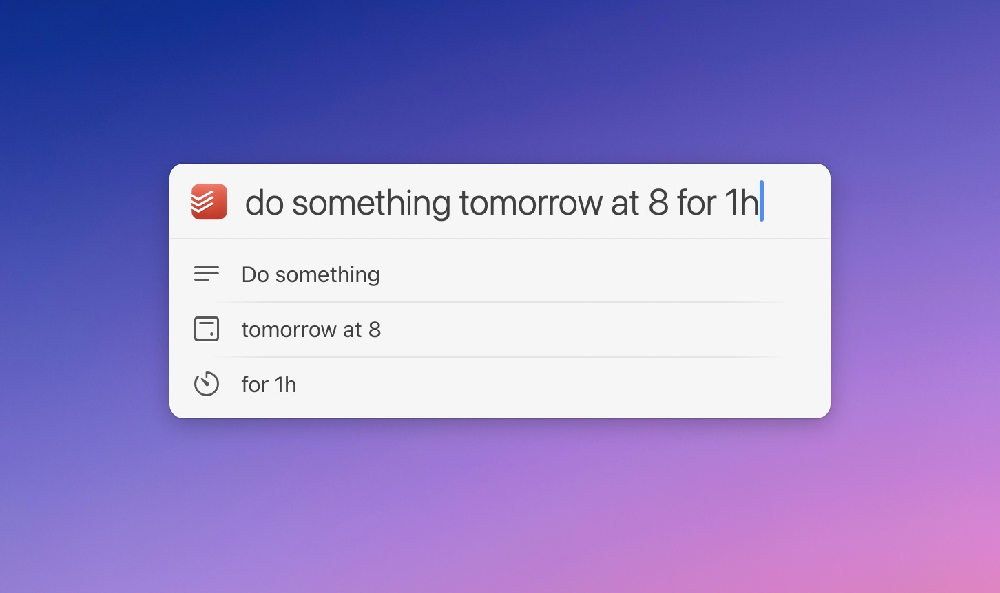

# LaunchBar Action: Todoist Inbox

## Why? 
Todoist has its own [quick add function](https://todoist.com/help/articles/task-quick-add). And it’s really really good! So what’s the benefit of a LaunchBar action?

If you don't mind using global shortcuts, there really is not much of a good reason. Even if you do mind, you could do, what I did for a long time. For a long time, I would use a custom action to either simulate pressing the global shortcut or lately launching it with the URI scheme "todoist://addtask". 

The were only a few minor things bugging me with when using my old action: 

1) Running the action, when Todoist is not running. My old action does not work in that (rare) case. Neither does the global shortcut. The app needs to run first. The new action does not need the app running, because it is using the API directly. 

2) When working in fullscreen mode the old action would result in switching to the desktop or the interface would show up on my other screen. 

3) My old action would also frequently bring up the main Todoist interface.

4) Evoking LaunchBar first and then Todoists quick add interface seemed to be more "noise" than needed. 

**Obviously some of this could easily be solved by just using the global shortcut. But I just like the LaunchBar workflow of pressing cmd-space followed by the initials of the app/action**. It's second nature. It's easier to remember and execute than most global shortcuts. It's kind of my [hyper key](https://thesweetsetup.com/macos-hyper-key-bettertouchtool/).  

So I took another look at the [API](https://developer.todoist.com/rest/v1/#create-a-new-task) and started making this action.

## How it works

The basic idea is very simple. **You select the action in LaunchBar (or the app), hit space, type a few words, hit return, it's in your inbox.** That's it. This is the main purpose. Hence the name.

 

However, as I enjoyed adding things to Todoist that way, I added a few more features: 

### Descriptions

Simply use a colon to add a description.

 

### Due dates and times

Todoists [Natural Language support](https://todoist.com/help/articles/due-dates-and-times#some-example-date-formats-you-can-use) is the best I have seen in any app. Fortunately you can make use of it with the API.

The action will detect a bunch of due strings like "today, next week, …" automatically (German or English depending on the current locale of your system). The action will provide feedback on how it parses your input. 

 

If what you are typing is not detected automatically, you can add "@" at the beginning of your due string to force the action to use that as the due date/time. (In that case just make sure your date string is not followed by some content you want to use for the title.) 

### Priorities

Add priorities like you would in Todoists interface with p1-3.

 

### Projects, sections and labels

If you press `⌘ ⏎` (command + return), you can select a project, section or label after hitting return. 

 

Select a project, section or label with arrow keys or by typing its name. If you select a label you will be also prompted to select a project/section after confirming with `‌↩`. (Due to interface restrictions you are limited to just one tag.)

I also built some smart into it. Projects, sections and labels you use frequently will rank higher in the list. The same is true if a project, section or label name is part of your entered task. Additionally the action will store used words by project/section/label. If what you type matches one or more previously used words of a project/section/label, that project/section/label will also be ranked higher. 
Let's say you frequently add a task containing the word "exercise" to a project named "health". It is very likely that "health" will be on top of the list of projects/section/labels. So all you have to do is hit return. 

### Bonus: URLs from Safari or Mail

You can even add markdown formatted links for the current website in Safari or a selected email in Mail if you start with a "." 

 

### Setup & Settings

You need an API-Token for this action, which you can find when you scroll all the way to the bottom in Todoists [integration settings](https://todoist.com/app/settings/integrations). 
You will be prompted to add it on the first run. 

Hit `⇧ ↩` (shift + return) to get to the settings. You can change the API-Token, refresh preloaded data (stored in `~/Library/Application Support/LaunchBar/Action Support`) or turn off confirmation notifications. 

## Download

[Download LaunchBar Action: Todoist Inbox](https://minhaskamal.github.io/DownGit/#/home?url=https://github.com/Ptujec/LaunchBar/tree/master/Todoist-Inbox) (powered by [DownGit](https://github.com/MinhasKamal/DownGit))

## Updates

The latest version of this action integrates with Action Updates by @prenagha. You can find the [latest version in his Github repository](https://github.com/prenagha/launchbar). For more information and a signed version of Action Updates [visit his website](https://renaghan.com/launchbar/action-updates/).

