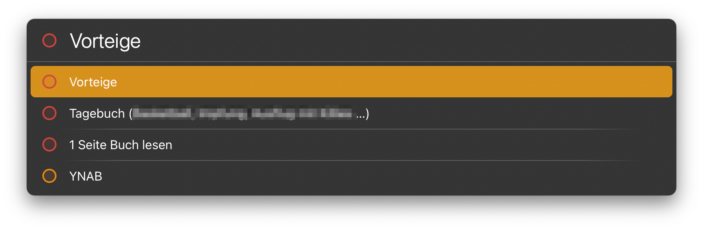

# LaunchBar Action: Todoist Today

This is a simple action which allows you to take a glance at your tasks for today. If there is a link in the task you can open it. Other wise return will open the Todoist app. 
 
 

## Installation
You need to enter your API-Token in default.js. You can find your token in Todoists preferences/integrations, when you scroll all the way to the bottom. 

## Download

[Download LaunchBar Action: Todoist Today](https://minhaskamal.github.io/DownGit/#/home?url=https://github.com/Ptujec/LaunchBar/tree/master/Todoist-Today) (powered by [DownGit](https://github.com/MinhasKamal/DownGit))