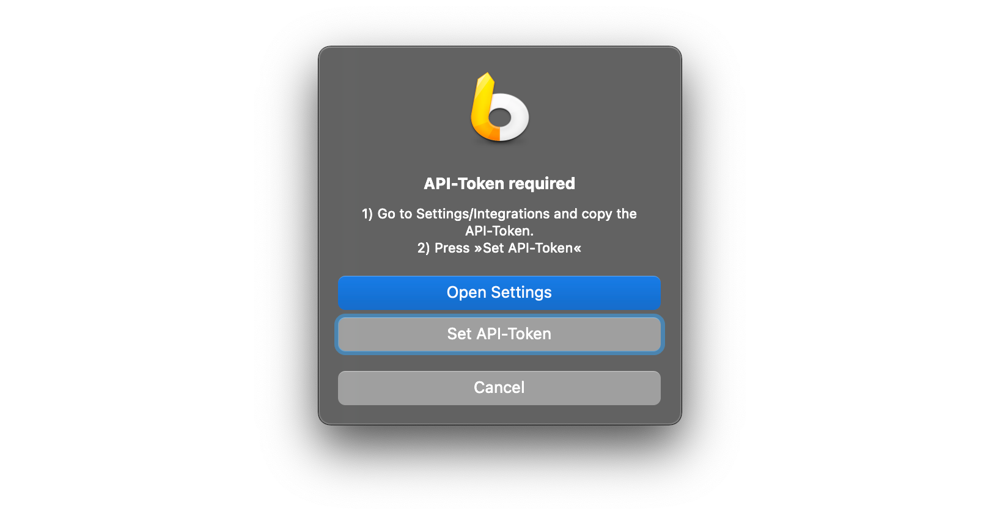

# LaunchBar Action: Todoist Today

This is a simple action which allows you to take a glance at your tasks for today. If there is a link in the task you can open it. Other wise return will open the Todoist app. 
 
 

## Requirements 

You need an API-Token for this action, which you can find when you scroll all the way to the bottom in [integration settings](https://todoist.com/app/settings/integrations). 
Copy it to you clipboard and run the action.

 

## Download

[Click here](https://github.com/Ptujec/LaunchBar/archive/refs/heads/master.zip) to download this LaunchBar action along with all the others. Or [clone](https://docs.github.com/en/repositories/creating-and-managing-repositories/cloning-a-repository) this repository.