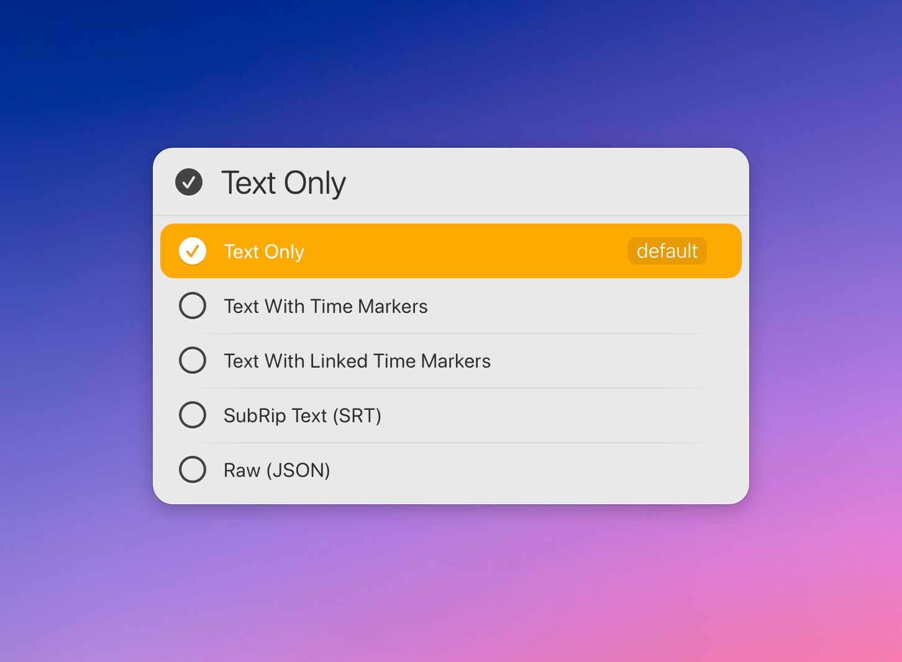
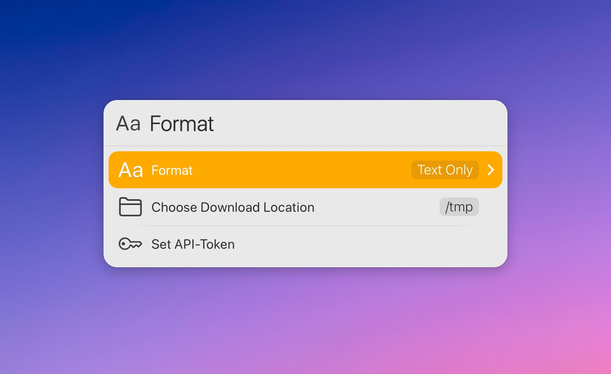

# LaunchBar Action: Transcripts (YouTube)

*[→ See a list of all my actions here.](https://ptujec.github.io/launchbar)* 

This action allows you to download transcripts from YouTube videos. You can pass a URL to the action, or simply press `Enter` to let the action retrieve the URL from your browser.

Then choose the desired transcript language.

After confirming with `Enter`, the action will create and open a plain text file of the transcript in a format of your choice.

You can choose a default format in Settings (see below). Additionally, you can choose a different format for the current transcript by holding the `Command` key while confirming with `Enter`.

## Requirements

The actual downloading of a transcript requires an API key. You can get yours [here](https://rapidapi.com/nikzeferis/api/youtube-captions-transcript-subtitles-video-combiner). The basic plan is free.

You will be prompted to enter it upon first use.

## Settings

When you hold `Option` and press `Enter`, you can choose a format for the transcript. You can decide whether the output should include time markers and/or links, be a properly SRT-formatted transcript, or just show the raw JSON file.

In Settings, you can also change the download directory. By default, it is your temporary folder (`/tmp`).

You can also reset your API key there. This information is stored locally in the [Action Support Path](https://developer.obdev.at/resources/documentation/launchbar-developer-documentation/#/script-environment).

## Good to Know

1) Some videos don’t provide transcripts. 

2) This action works best with Safari because it saves a load request.

## Download & Update

[Click here](https://github.com/Ptujec/LaunchBar/archive/refs/heads/master.zip) to download this LaunchBar action along with all the others. Or simply use [LaunchBar Repo Updates](https://github.com/Ptujec/LaunchBar/tree/master/LB-Repo-Updates#launchbar-repo-updates-action)! It helps automate updating existing and installing new actions.
