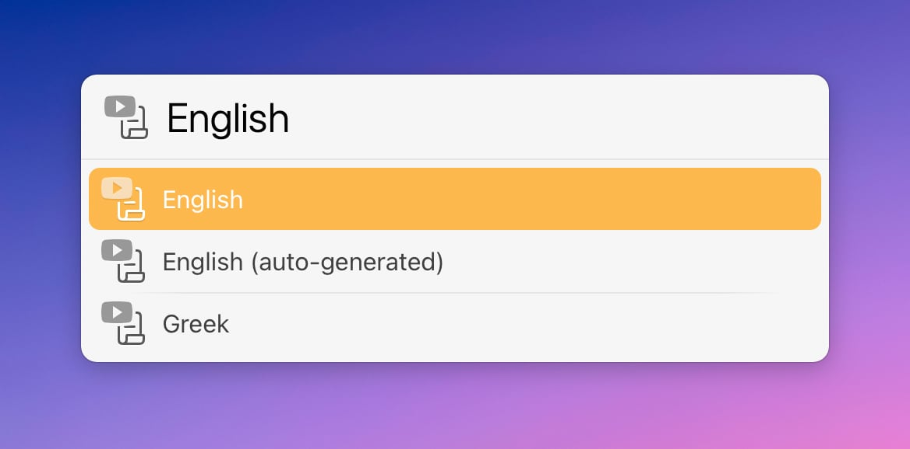

# LaunchBar Action: Transcripts (YouTube)

*[→ See a list of all my actions here.](https://ptujec.github.io/launchbar)* 

This action allows you to download transcriptions from YouTube videos. You can pass a URL to the action, or simply press <kbd>enter</kbd> to let the action retrieve the URL from your browser.

Then choose the desired transcription from the list of languages.

The action will create and open a plain text file with the selected transcript in Markdown format.

## Settings

When holding <kbd>option</kbd> while pressing <kbd>enter</kbd>, you can decide if you want to include time markers and links or not by default.

If you hold <kbd>command</kbd> when confirming to download a transcript, it will use just the text with no markers or links.

## Good to Know

1) Some videos don’t provide transcriptions. 

2) This action works best with Safari because we save a load request. 

3) Also, this action is not using an official API, so it might break. [Let me know if you run into any issues](https://github.com/Ptujec/LaunchBar/issues/new).

## Download & Update

[Click here](https://github.com/Ptujec/LaunchBar/archive/refs/heads/master.zip) to download this LaunchBar action along with all the others. Or simply use [LaunchBar Repo Updates](https://github.com/Ptujec/LaunchBar/tree/master/LB-Repo-Updates#launchbar-repo-updates-action)! It helps automate updating existing and installing new actions.
