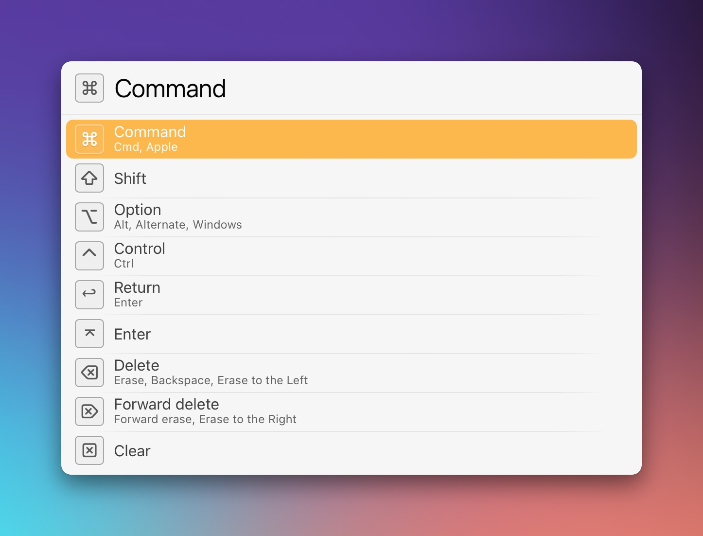
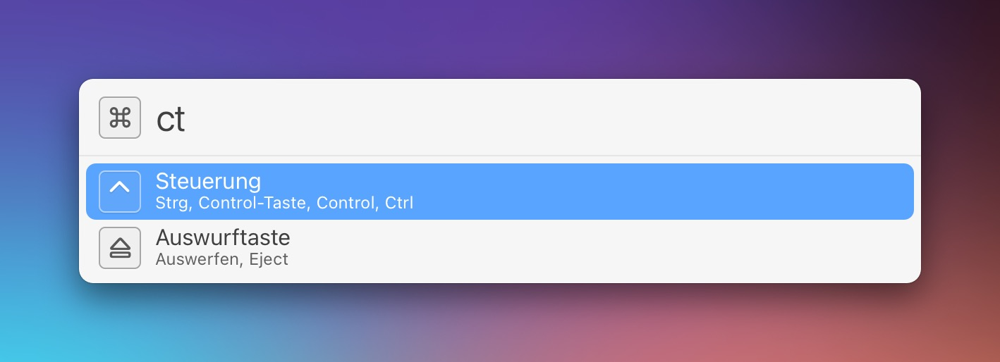

# LaunchBar Action: Unicode Function Keys 

As the name reveals this action lists unicode characters of function keys on your keyboard. 

You can either browse the list with `↩` 

 

Or you can search after pressing space `␣`. This will allow you to search for English names even if your UI language is German.

 

Paste selected character with `↩`, character marked as code with `⌥↩` or the html entity with `⇧↩`. 

**BTW:** There is an action with many more [Unicode characters](https://github.com/snchong/launchbar-unicode) by [@snchong](https://github.com/snchong).

## Download

[Click here](https://github.com/Ptujec/LaunchBar/archive/refs/heads/master.zip) to download this LaunchBar action along with all the others. Or [clone](https://docs.github.com/en/repositories/creating-and-managing-repositories/cloning-a-repository) this repository.

## Updates

Use [Local Action Updates](https://github.com/Ptujec/LaunchBar/tree/master/Local-Action-Updates#launchbar-action-local-action-updates) to keep track of new versions of all my actions and discover new ones at the same time. 

This action also supports [Action Updates](https://github.com/prenagha/launchbar) by Padraic Renaghan.