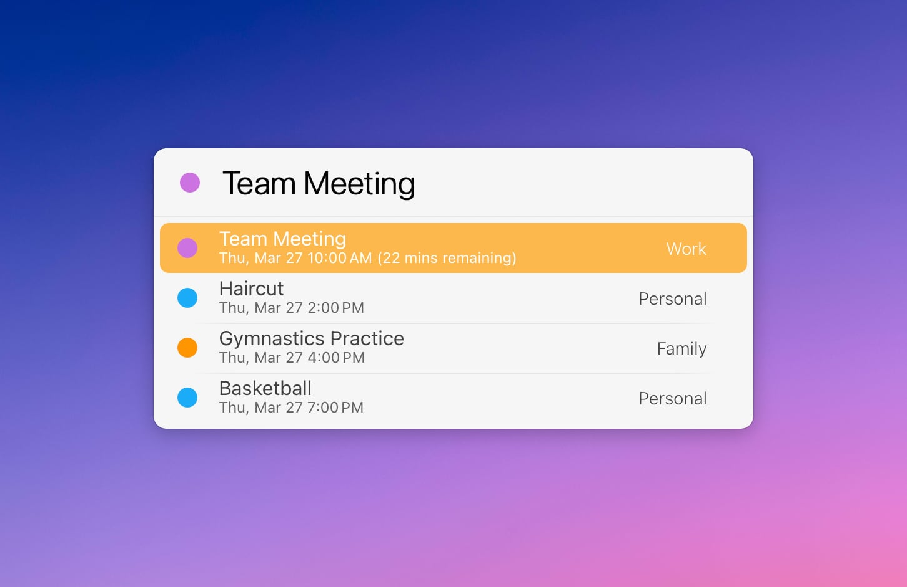
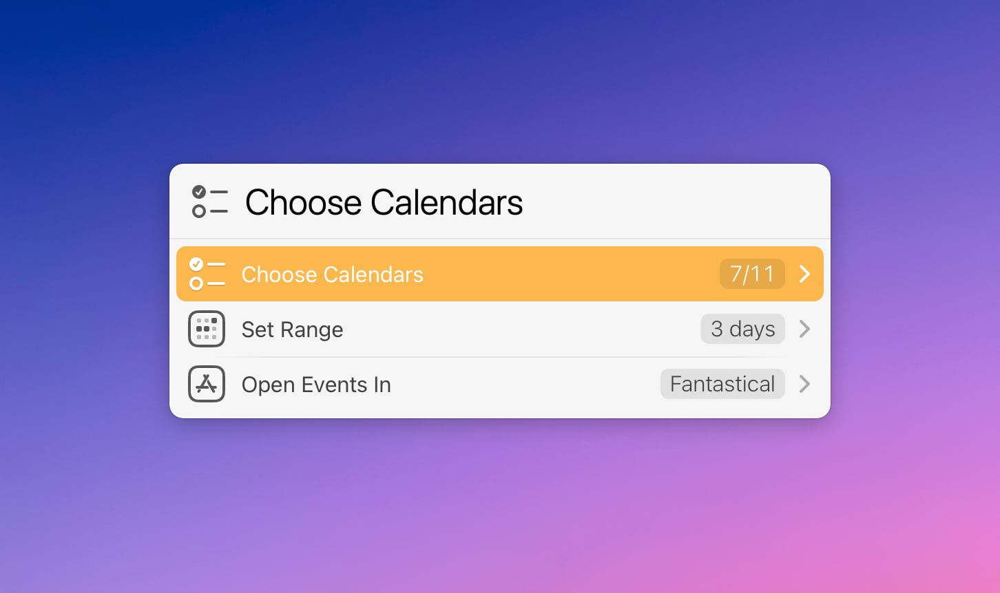

# LaunchBar Action: Upcoming 

This action lists upcoming calendar events. You can display the details of a selected event in your calendar app by pressing `enter`.

## Settings

Hold `option` to view action settings. 

 

You can choose which calendars to include, how many days to show, and in which app event details will be displayed. 

The action currently supports opening events in [Fantastical](https://flexibits.com/fantastical), [BusyCal](https://www.busymac.com), or in Apple’s calendar app. 

**Note:** Apple’s calendar app does not offer a way to open a recurring event to a specific occurrence. It will always show the first occurrence. So instead of showing event details, the action will just open the calendar app.  

## Installation & Requirements (IMPORTANT!)

Unfortunately, in order to run smoothly, actions written in Swift need to be both "unquarantined" and compiled. I made [a dedicated action that does both](https://github.com/Ptujec/LaunchBar/tree/master/Compile-Swift-Action#readme). Run the `.lbaction` bundle of this action through the compile action before you start using it.

This action requires **full calendar access**. You will be prompted for it. You can also access the relevant privacy settings (System Settings → Privacy & Security → Calendars) by pressing `enter` on the alert message in the LaunchBar interface. 

## Download & Update

[Click here](https://github.com/Ptujec/LaunchBar/archive/refs/heads/master.zip) to download this LaunchBar action along with all the others. Or simply use [LaunchBar Repo Updates](https://github.com/Ptujec/LaunchBar/tree/master/LB-Repo-Updates#launchbar-repo-updates-action)! It helps automate updating existing and installing new actions.