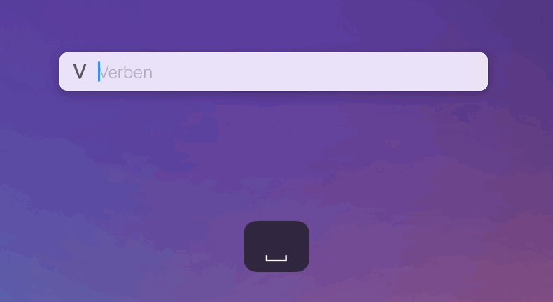

# LaunchBar Action: Verbs

This is a simple action for looking up basic English verb conjugations. 

 

You can hit `⏎` (return) on a result to open it on [https://dictionary.cambridge.org](https://dictionary.cambridge.org/dictionary/english/meet) for more details (e.g. US and UK pronunciation). Or you can hit `⇧⏎` (shift + return) to paste it into a text field or document.

## Download

[Click here](https://github.com/Ptujec/LaunchBar/archive/refs/heads/master.zip) to download this LaunchBar action along with all the others. Or [clone](https://docs.github.com/en/repositories/creating-and-managing-repositories/cloning-a-repository) this repository.

## Updates

Use [Local Action Updates](https://github.com/Ptujec/LaunchBar/tree/master/Local-Action-Updates#launchbar-action-local-action-updates) to keep track of new versions of all my actions and discover new ones at the same time. 

This action also supports [Action Updates](https://renaghan.com/launchbar/action-updates/) by Padraic Renaghan.