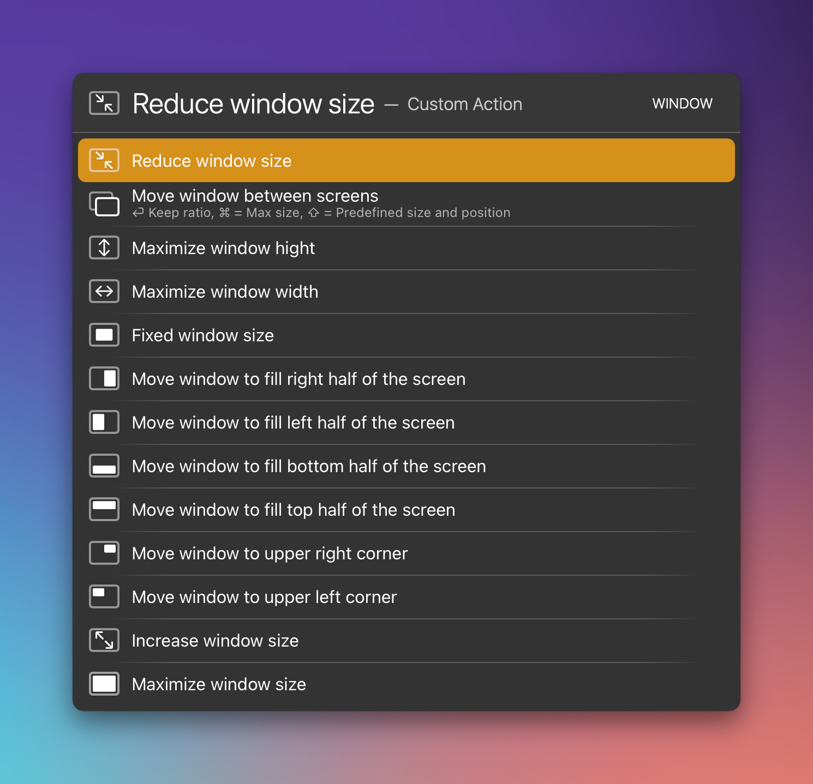
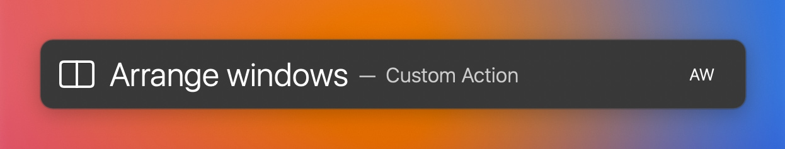
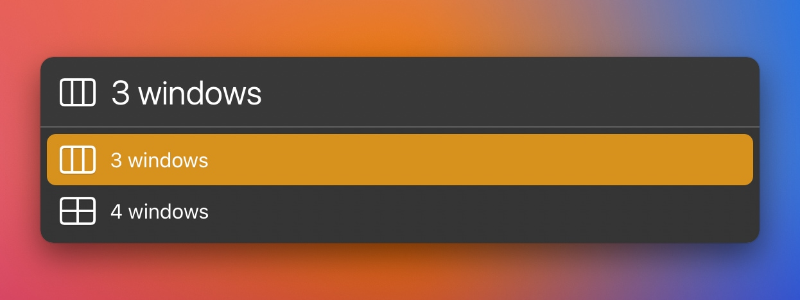

# LaunchBar Window Actions

 

Window actions are applied to the currently active window on your main screen. The action "Move window between screens" is made for two screens.

## Arrange windows

This action arranges 2-4 windows evenly on the screen. 2 windows is the default. 

 

For the other options press `space` or `⌘↩`.

 

## Download

Unfortunately this directory is to big for [DownGit](https://github.com/MinhasKamal/DownGit). 
You need to [download the whole repository](https://github.com/Ptujec/LaunchBar/archive/refs/heads/master.zip) for this one.

## Updates

This action integrates with Action Updates by @prenagha. You can find the [latest version in his Github repository](https://github.com/prenagha/launchbar). For more information and a signed version of Action Updates [visit his website](https://renaghan.com/launchbar/action-updates/).

