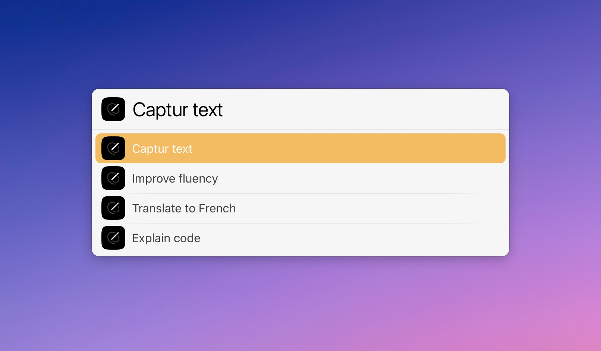

# LaunchBar Actions for Writers brew

This is more of a proof of concept than a proper action. It should not be hard to build upon it though. 
You will get the idea if you take a look at the `default.js` of the action in Action Editor. 

To use the action, just select the action or the app and press `space`.

 

## Download

[Click here](https://github.com/Ptujec/LaunchBar/archive/refs/heads/master.zip) to download this LaunchBar action along with all the others. Or [clone](https://docs.github.com/en/repositories/creating-and-managing-repositories/cloning-a-repository) this repository.

## Updates

Use [Local Action Updates](https://github.com/Ptujec/LaunchBar/tree/master/Local-Action-Updates#launchbar-action-local-action-updates) to keep track of new versions of all my actions and discover new ones at the same time. 

This action also supports [Action Updates](https://renaghan.com/launchbar/action-updates/) by Padraic Renaghan.

