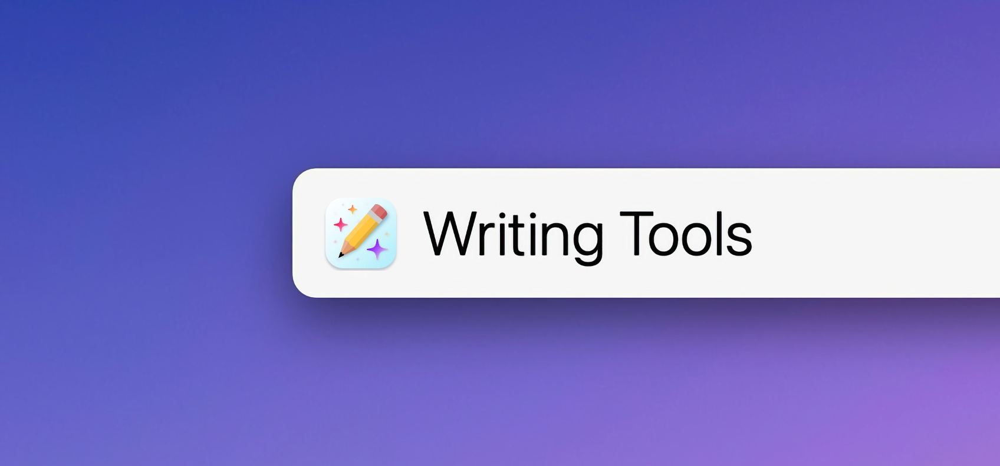
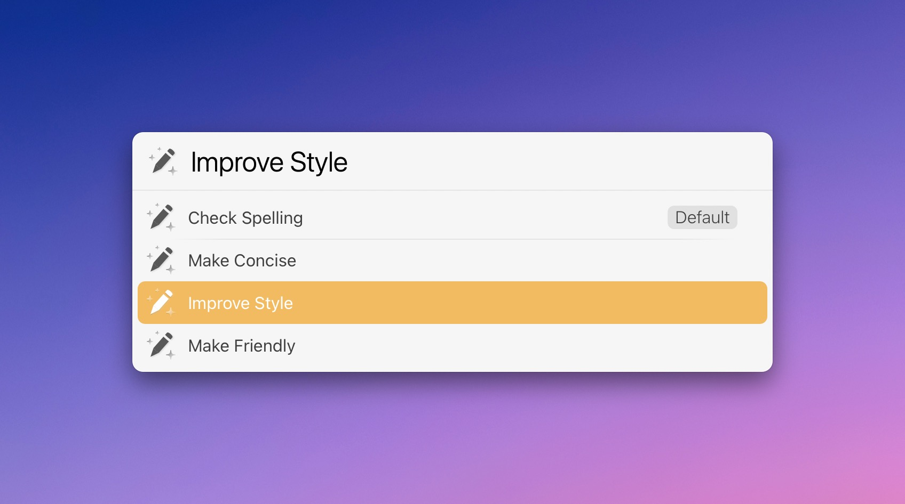
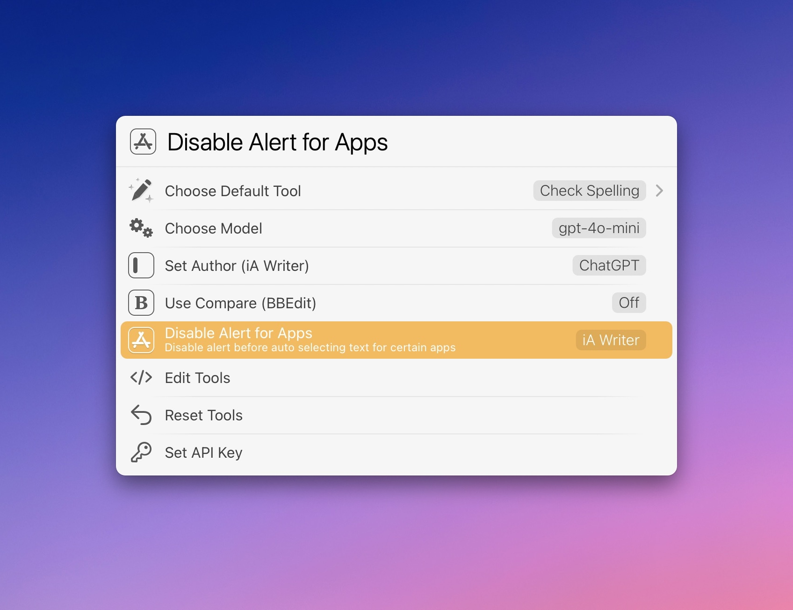

# LaunchBar Action: Writing Tools (powered by ChatGPT)

*[→ Click here to view a list of all my actions.](https://ptujec.github.io/launchbar)* 

 

Writing Tools[^1] is an action that can help improve your writing, e.g. by checking your spelling, grammar, and punctuation.[^2] 

You can select and **send text** to the action or have it **select all text automatically**.[^3]   

The changed text will replace the selection.

The action works with any text field in any app. However, **it works best with iA Writer** and its [powerful feature to distinguish between authors](https://ia.net/writer/support/editor/authorship). This way, you can easily see all the changes made by ChatGPT.

If you prefer, you can also use the [BBEdit](https://www.barebones.com) comparison feature instead.

***Note:** The iA Writer paste feature uses [GUI scripting](http://www.macosxautomation.com/applescript/uiscripting/) and may not work properly after an update of iA Writer. Please [report](https://github.com/Ptujec/LaunchBar/issues/new) any issues you encounter.* 

## Tools

By default, the action will use your default tool (see Settings). To select a different tool, press `Command` + `Enter`. Tools are fully customizable (see Edit tools).

 


## Settings

Access the settings with `Option` + `Enter`. 

 

## Edit tools

You can customize and add as many tools as you like. Make sure you keep the JSON syntax intact; otherwise, tools will be reset to the default set of tools. Below is an example of how the code looks:

```
{
  "tools" : [
    {
      "id" : "1",
      "title" : "Check spelling",
      "prompt" : "Correct the following text:\n",
      "persona" : "You are a proofreader. Review the provided input for any spelling, grammar, or punctuation errors. Answer in the language of the provided text."
    },
    {
      "id" : "2",
      "title" : "Make concise",
      "prompt" : "Make the following text more concise:\n",
      "persona" : "You are an editor. Remove unnecessary words to achieve a concise, simple and coherent text with correct spelling, grammar and punctuation. Answer in the language of the provided text."
    }
  ]
}
```

## Requirements

To use this action, you need an [API key from OpenAI](https://platform.openai.com/account/api-keys). If you're using my [Ask ChatGPT](https://github.com/Ptujec/LaunchBar/tree/master/Ask-ChatGPT#readme) action already, it will automatically import the key.

## Download

[Click here](https://github.com/Ptujec/LaunchBar/archive/refs/heads/master.zip) to download this LaunchBar action along with all the others. Or [clone](https://docs.github.com/en/repositories/creating-and-managing-repositories/cloning-a-repository) this repository.

## Updates

This action integrates with Action Updates by @prenagha. Find the [latest version on his GitHub](https://github.com/prenagha/launchbar) and a signed version on his [website](https://renaghan.com/launchbar/action-updates/).

[^1]: I have not had the chance to try Apple's AI Writing Tools, but so far, they do not sound too promising anyway. With this action, you can always benefit from the latest OpenAI models and refine the tools yourself.
[^2]: Please consider privacy and the pitfalls of using LLMs in general as you use this. 
[^3]: In the case of automatic text selection there is an alert to protect you from triggering this accidentally. You can disable that alert for a given app in settings (`Option` + `Enter`).