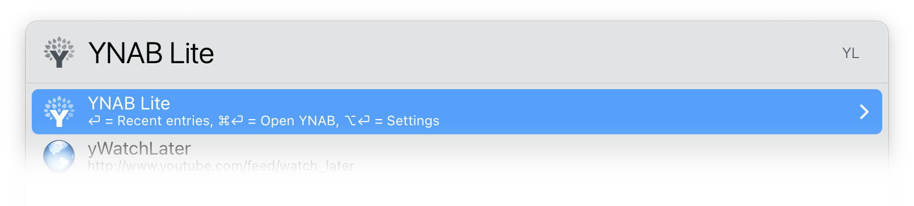
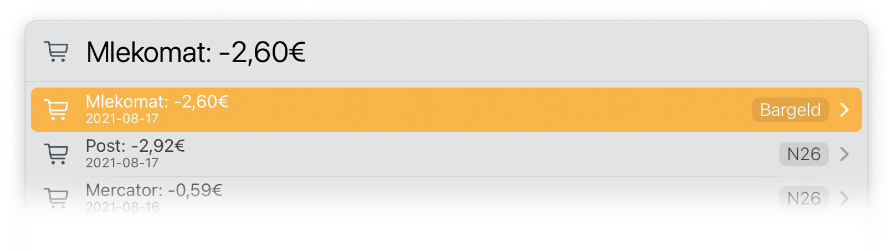
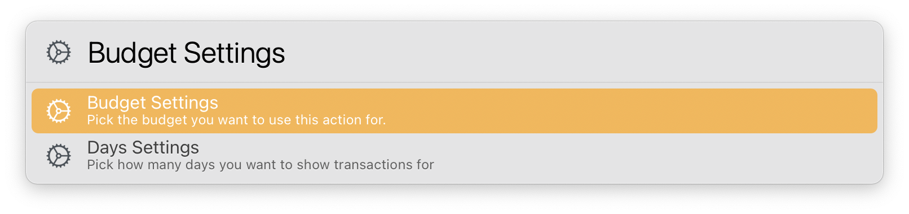

# YNAB Actions

There is only one right now. But I have more in the pipe (e.g. Quick Add) that need some work before I can share them.

## YNAB Lite

 

 

 

This action gives you a quick glance at your last transactions. You can set the period to look for (from 10 days to a whole year)

On the first run you will need to set your Personal Access Token, which you can get in [YNAB Developer Settings](https://app.youneedabudget.com/settings/developer). 

## Download

[Download YNAB Actions](https://minhaskamal.github.io/DownGit/#/home?url=https://github.com/Ptujec/LaunchBar/tree/master/YNAB-Actions) (powered by [DownGit](https://github.com/MinhasKamal/DownGit))

