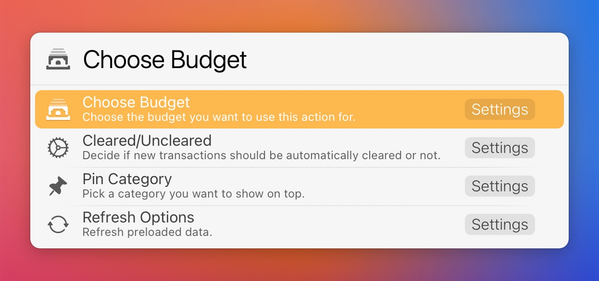
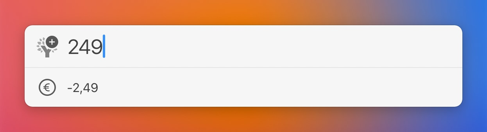
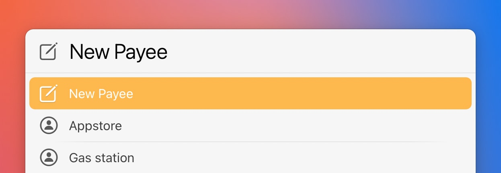
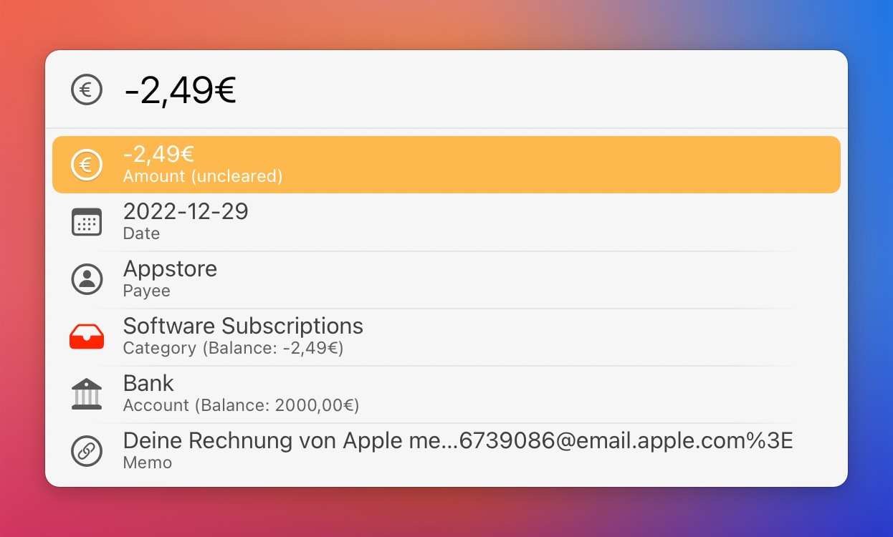
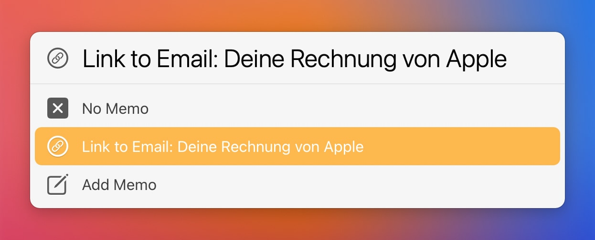
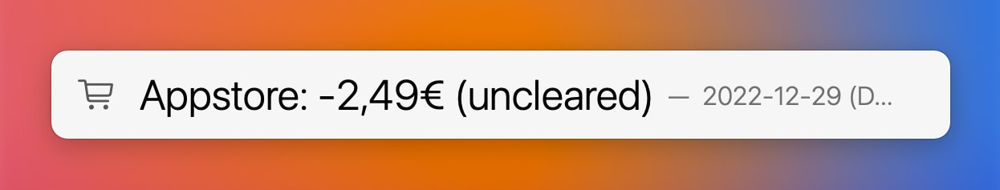
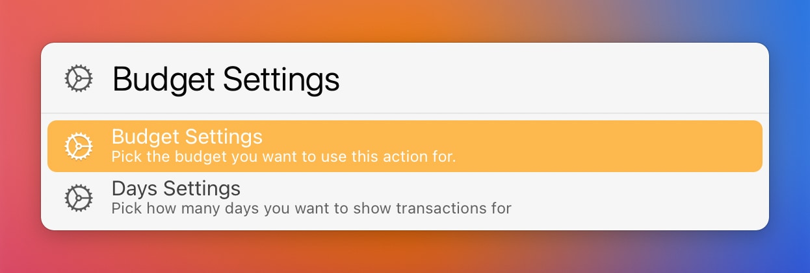

# YNAB Actions
For use with [You Need A Budget](https://www.youneedabudget.com/).   

## YNAB - Add Transaction  

This action does what the name suggests, it adds a transaction to YNAB the [LaunchBar](https://www.obdev.at/products/launchbar/index.html) way. It's fast and efficient. No need to grab your phone or wait for the webapp to load. 

On the first run you will need to set your Personal Access Token, which you can get in [YNAB Developer Settings](https://app.youneedabudget.com/settings/developer). 

You also need to choose the budget you want to use the action for. You can always change that later (along with a bunch of other things) in the settings by just hitting enter. 

 

**To add a transaction** begin with entering the amount by pressing the spacebar. 

 

Confirm with enter and you will be presented with the next step (selecting or creating a new payee). 

 

No worries if you made a mistake. In most cases you can go back one or more steps with the left arrow key. After the last step (adding a memo or selecting "no memo") the transaction will be created and you will get a confirmation like this: 

 

**A special goodie for users of Apple Mail**:
If you have an Email selected or open in Apple Mail you can add the link to that Email (e.g. the bill you are paying) as a memo. If you use the YNAB Lite action you can open those Email links by hitting return on a transaction with an Email link there.

 

**Important:** For performance reasons some data is preloaded and stored in ~/Library/Application Support/LaunchBar/Action Support/. New Payees will be added as you create them using this action. You can also update or even reset all data in the settings manually. 

##  YNAB Lite  

 

  

This action gives you a quick glance at your recent transactions. You can set the period to look for (from 10 days to a whole year)

On the first run you will need to set your Personal Access Token, which you can get in [YNAB Developer Settings](https://app.youneedabudget.com/settings/developer). 

Options:
- `⌘⏎` Open the webapp 
- `⌥⏎` Settings (Budget, Days)

## Download

[Click here](https://github.com/Ptujec/LaunchBar/archive/refs/heads/master.zip) to download this LaunchBar Action along with all the others. Or [clone](https://docs.github.com/en/repositories/creating-and-managing-repositories/cloning-a-repository) this repository.

## Updates

The latest version of this action integrates with Action Updates by @prenagha.    You can find the [latest version in his Github repository](https://github.com/prenagha/launchbar). For more information and a signed version of Action Updates [visit his website](https://renaghan.com/launchbar/action-updates/).
