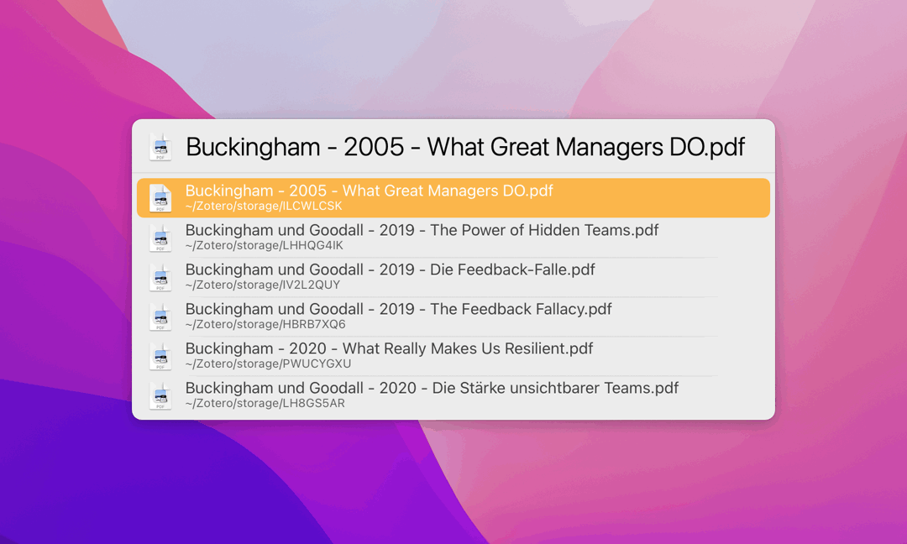

# LaunchBar Actions for Zotero

Here are two actions that make working with Zotero (attachments) a little more fun. 

## Search 

 

This action searches the Zotero storage folder for attachments (PDFs, …). By default it will search in filenames, titles, authors, tags and comments. 

If there are no hits it will fall back to a broader search, searching all document contents. If you want to force that behavior directly you can do that with ⌘⏎ after you enter the search query.

Results are returned to LaunchBar so you can easily preview them with Quicklook (spacebar).

You can use the following action to show an attachment in the Zotero interface.

## Show Attachment in Zotero

 

## Recommendation

You can improve search results if you rename your pdfs with meaningful information. A great help for that is [ZotFile - Advanced PDF management for Zotero](http://zotfile.com/).

## Download

[Download LaunchBar Actions for Zotero](https://minhaskamal.github.io/DownGit/#/home?url=https://github.com/Ptujec/LaunchBar/tree/master/Zotero-Actions) (powered by [DownGit](https://github.com/MinhasKamal/DownGit))

## Updates

LaunchBar Actions for Zotero integrate with Action Updates by @prenagha. You can find the [latest version of Action Updates in his Github repository](https://github.com/prenagha/launchbar). For more information and a signed version of Action Updates [visit his website](https://renaghan.com/launchbar/action-updates/).

