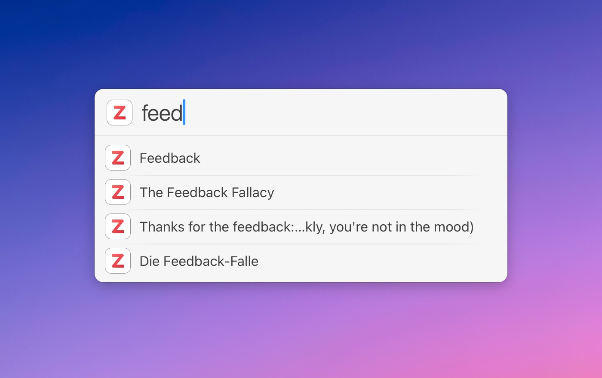

# LaunchBar Action for Zotero

Search, browse, and act on items from your local Zotero database. 

## Search 

 

As you begin your search, helpful suggestions will appear, including creator names, tags, and titles.

If your search returns no results in the database, the action will automatically search the content of your local attachments (PDFs) using [`mdfind`](https://metaredux.com/posts/2019/12/22/mdfind.html).

**Note**: You can also directly search both the database and your local attachments with `command` + `enter`. 
  

## Browse

 

If you press `Enter` instead of `space`, you can browse your database by creators, tags, collections, or all items. 

Additionally, you have quick access to your three most recently used items.

## Details & Actions

 

If you hit `Enter` on a particular item, you can see more details such as tags, publications, links, or attachments. 

Many of the details also offer further functionality. For instance, you can quickly look inside an attached PDF.

  

Here is a list of possible actions: 

#### 1) More Browsing

You can browse other items that are part of the same collection, publication, book, have the same tag, or are written by the same author.

#### 2) Interact with Attachments

You can use quicklook, open the attachment, or even mail it to someone. There are plenty of possibilities. [(If you are new to LaunchBar, take a look at the "Joining Forces" video.)](https://www.obdev.at/products/launchbar/videos.html)

#### 3) Open Links 

#### 4) Open Item in Zotero

**Note**: This will always open Zotero, but it may fail to select the item on the first attempt if Zotero is not running previously. This is a limitation of Zotero. In this case, use the action again once Zotero is running.

#### 5) Cite and Link

Cite and Link offers a short citation (e.g. `(Buckingham & Goodall, 2019)`) and a link to the item in Zotero. By default, the citation is pasted in the front document and the link is copied to the clipboard. You can also choose to paste them together as rich text or in markdown format by going to settings and selecting your preferred format (`option` + `return`).

**Note:** This action's citation function is not enough to write a paper, primarily as it does not yet support custom citation styles. Nevertheless, it should be a great help during research.

#### 6) 🪄 The Magic Title Item

As this LaunchBar action is primarily tailored to give you quick access to the content of your Zotero database, the title item has kind of "superpowers". If a PDF is attached, you can open the PDF right from that item using quick look. If there is no PDF, but there is a link, you can open that instead. If none of these options are available, pressing `enter` will reveal the item in Zotero.

## Shortcuts

There are also some shortcuts (modifier keys) that work with any selected Zotero item. 

- Open a given item in Zotero with `command` + `return`
- Paste a citation with `shift` + `return`   

Those even work on the top level. So you don't need to go into details to use them.

## Download

[Download LaunchBar Action for Zotero](https://minhaskamal.github.io/DownGit/#/home?url=https://github.com/Ptujec/LaunchBar/tree/master/Zotero-Actions) (powered by [DownGit](https://github.com/MinhasKamal/DownGit))

## Updates

This action integrates with Action Updates by @prenagha. You can find the [latest version of Action Updates in his Github repository](https://github.com/prenagha/launchbar). For more information and a signed version of Action Updates [visit his website](https://renaghan.com/launchbar/action-updates/).

