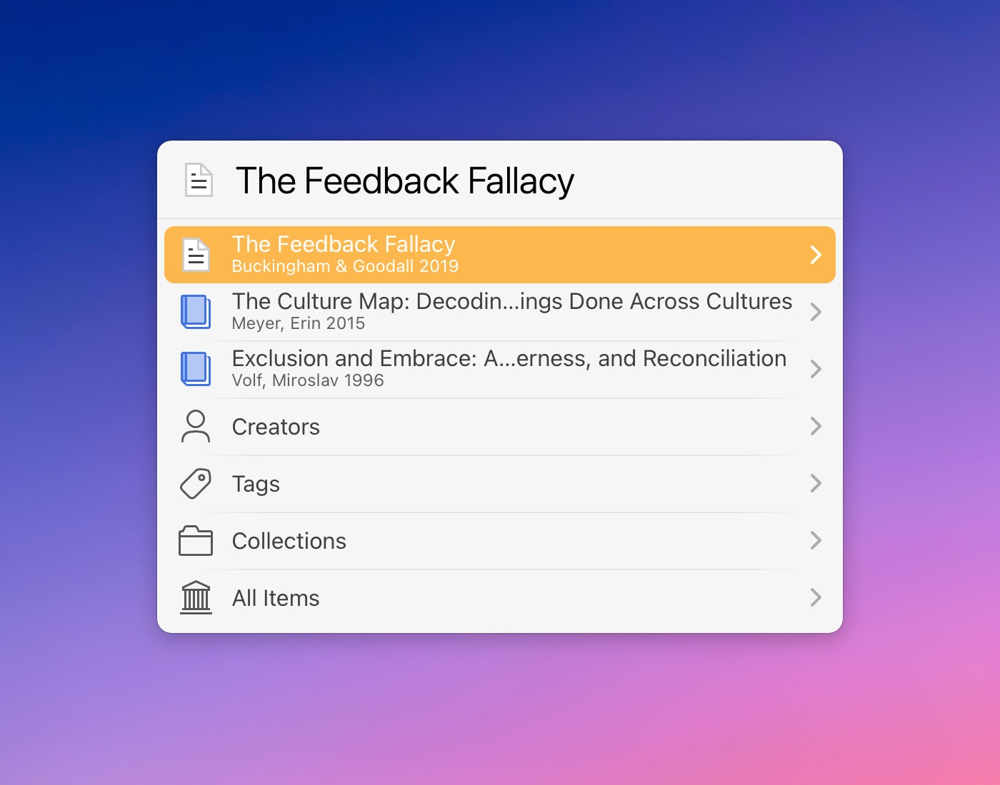

# LaunchBar Action for Zotero

Enjoy the brand new action for Zotero. This new action let's you do everything the old did and much more in one simple yet powerful action. 

## Search 

 

As you search you get helpful suggestions that include creator names, tags and titles. 

If there is no match in the database the action will fall back to searching your local attachments (PDFs) using [`mdfind`](https://metaredux.com/posts/2019/12/22/mdfind.html).

**Note**: You can also directly search both the database and your local attachments with `command` + `enter`. 
  

## Browse

 

If you hit `enter` instead of `space` you can browse your database by creators, tags, collections or simply all items. 

In addition you have quick access to your 3 most recently used items.  

## Details & Actions

 

If you hit `enter` on a given item you can reveal more details such as tags, publications, links or attachments. 

A lot of the details also offer further functionality. You can e.g. take a quick look inside an attached PDF.

  

Here is a list of possible actions: 

#### 1) More browsing 

You can browse other items that are part of the same collection, publication, book, have the same tag or are written by the same author

#### 2) Interact with attachments

LaunchBar is a great file browser and this action makes use of it. Use quicklook, open the attachment or mail it to someone. There are lots of possibilities. ([Take a look at the "Joining Forces" video if you are new to LaunchBar.](https://www.obdev.at/products/launchbar/videos.html))

#### 3) Open links 

#### 4) Open item in Zotero

**Note**: Open in Zotero does not fully work when the Zotero is not running. It will open Zotero but it won't select the item on the first attempt. This is a limitation of Zotero. 
In this case just use the action again once Zotero is running. 

#### 5) Cite and link

Cite and link offers both a short citation (e.g. "(Buckingham & Goodall, 2019)") and a link back to the item in Zotero. 

By default the citation is pasted in the front document and the link is put on the clipboard. 

But you can also choose to paste both together either as rich text or in markdown format. Go to settings to choose your preferred format (`option` + `return`)

**Note:** The citation offered by this action might not be enough yet for the actual writing of a paper. Especially since this does not yet support custom citation styles. But it can be a help during research.

#### 6) 🪄 The magic title item

As this action is mainly tailored to give you quick access to the content of your Zotero database the title item has kind of super powers. If there is a PDF attached you can use quicklook or open the PDF right from that item. If not but there is a link you can open that. Or if none of that is true `enter` will reveal the item in Zotero.

## Shortcuts

There are also some shortcuts (modifier keys) that work with any selected Zotero item. 

- Open a given item in Zotero with `command` + `return`
- Paste a citation with `shift` + `return`   

Those even work on the top level. So you don't need to go into the details to use them.

## Download

[Download LaunchBar Action for Zotero](https://minhaskamal.github.io/DownGit/#/home?url=https://github.com/Ptujec/LaunchBar/tree/master/Zotero-Actions) (powered by [DownGit](https://github.com/MinhasKamal/DownGit))

## Updates

This action integrates with Action Updates by @prenagha. You can find the [latest version of Action Updates in his Github repository](https://github.com/prenagha/launchbar). For more information and a signed version of Action Updates [visit his website](https://renaghan.com/launchbar/action-updates/).

